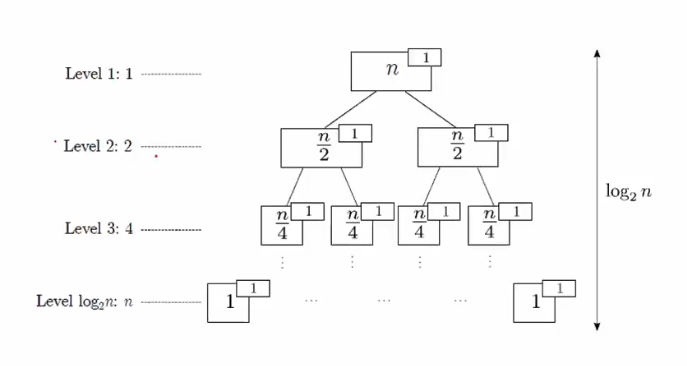
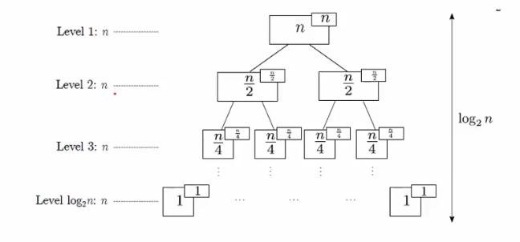

# Lecture 3

## 4 properties of an algorithm
1. Each step of an an algorithm must be _*exact*_

2. An algorithm must _*terminate*_

3. An algorithm must be _*effective*_
	- Must produce the intended result
		- An algorithm to cook curry chicken must produce curry chicken
			- if it produces curry chicken, then pass
			- if it produces charcoal, then fail

4. An algorithm should be _*general*_ (optional)
	- must work for all possible inputs
	- note however, there are some algorithms made for very difficult problems that do not satisfy this property
		- that is, they do not work for all possible inputs
		- not covered in this course

## 2 aspects of Efficiency/Complexity of algorithms
- Time Complexity (aka Time Requirement)
	- the focus of this course
	- refers to the number of steps
	- Kattis will check for this -> may not pass if your program has too many steps

- Space Complexity
	- not really emphasized in this course

## Exact run time is not always meaningful
- Literally using a stopwatch to measure how long the algorithm takes in milliseconds
	- not very useful as differences in aspects such as programming language used (maybe Python will run faster than C) may influence this

## One good way to assess Time Complexity
- Count the number of primitive operations needed.
	- examples of primitive operations:
		- \+
		- \-
		- \*
		- /
		- assignment

- to simplify counting even further, we can ignore:
	- the different types of operations, and
	- different number of operations in a statement
- so, simply count the number of statements executed

## Big-O Notation `O(g(n))`
Analysis of Worst-Case Scenarios.

### Some Common Growth-Terms `g(n)`

Logarithmic Functions

- `O(log(n))`
- the base for the logarithm doesn't matter
	- because any logarithm can be changed to logarithm with base 2 using a constant 
	- https://www.purplemath.com/modules/logrules5.htm

Sublinear Power Functions

- `O(n^0.0000001)`

Linear Functions

- `O(n)`

Linearithmic Functions

- `O(n log(n))`
	- n log(n)
	- log(n!)

Quadratic Functions

- `O(n^2)`

Polynomial Functions

Like Quadratic Functions, but with powers other than 2.
- `O(n^2.5)`
	- n^2.5

Exponential Functions

- `O(2^n)`
	- 2^n
	- 2^(n+1)
- `O(3^n)`
	- 3^n
- `O(4^n)`
	- 4^n
	- 2^(2n)

##### Notes for Exponential Functions
- O(2^((k * n) + c))
- k CANNOT be dropped
	- `O(2^4n)` IS NOT THE SAME AS `O(2^n)`

- c CAN be dropped
	- `O(2^(2k + 1))` IS THE SAME AS `O(2^2k)`
		- because can simplify to a constant multiplier of 2
			- which can be dropped

Factorial Functions

- `O(n!)`
- `O((n-1)!)`

##### Notes for Factorial Functions
- `O((n-1)!)` IS NOT THE SAME as `O(n!)`
	- because these differ by a factor of n
		- which is NOT a constant
		- hence, not tight upper-bound

Tetration

- `O(n^n)`

### Some additional notes
- "upper-bound is different from worst-case-scario"
- O(g(n)) + O(h(n)) = O(g(n) + h(n))
- `String` type is considered Immutable in this course
	- O(n) operation for String Concatenation operations - slide 44

## Techniques for finding the appropriate `O(g(n))`

### Substitution Method
TODO

### Recursive-Tree Method

### Master-Theorem Method

